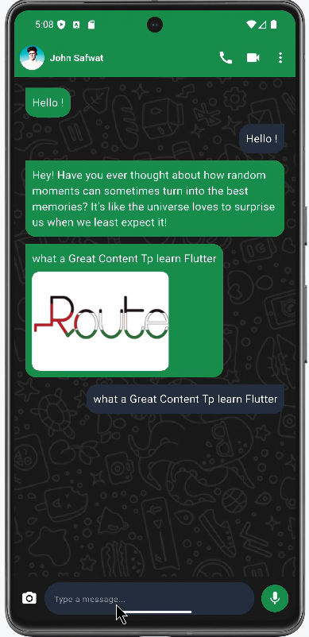

# 📱 WhatsApp UI Clone (Flutter)

A pixel-perfect clone of WhatsApp chat UI built with Flutter – replicating WhatsApp’s dark theme, custom chat bubbles, app bar, and message input field.



---

## 🚀 Features

- WhatsApp-style AppBar with profile, call/video icons
- Dark mode background with WhatsApp-style wallpaper
- Incoming/outgoing message bubbles with text and images
- Input field with camera, mic, and send icons
- Fully responsive Flutter layout

---

## 🛠️ How to Run Locally

1. Clone the repository or download the ZIP
2. Open in VS Code or Android Studio
3. Run:

```bash
flutter pub get
flutter run
